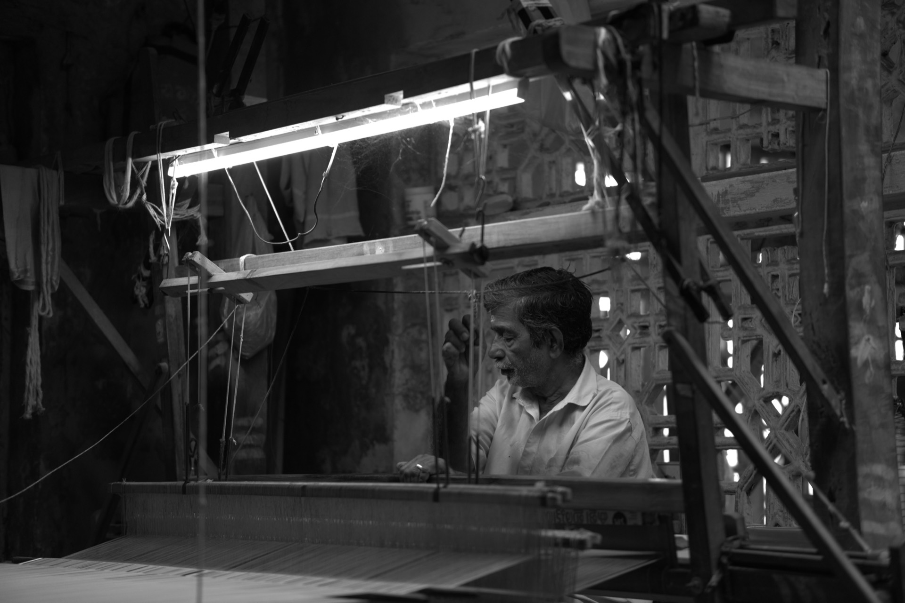

# Eravathody Handloom Weavers

## Overview
This project is the official website for the Eravathody Handloom Weavers' Co-operative Society. Located in Thiruvilwamala, Kerala, this society has been sustaining the traditional Deiva Thozhil (sacred duty) of weaving since 1941.

This website was developed as part of a Semester 6 Web Design Course project, with a focus on modern aesthetic principles, performance optimization, and cultural storytelling.

## Key Features
- Editorial Design: Utilizes a clean, modern aesthetic with carefully selected typography to reflect the rich heritage of the brand.
- Carbon Score Optimized: All high-resolution assets have been compressed and resized to reduce bandwidth consumption and lower the website's carbon footprint.
- SEO Optimized: Implemented comprehensive metadata across all HTML pages to ensure high search engine visibility.
- Interactive Storytelling: Features a sticky-scroll timeline detailing the weaving process and a 3D flipbook integration to showcase the official NIFT CRD research document.
- Responsive Layout: Fully functional and visually consistent across varying screen sizes.

## Technology Stack
- Structure: HTML5 (Semantic Markup)
- Styling: Vanilla CSS3 (Custom properties, Flexbox, Grid)
- Interactivity: Vanilla JavaScript
- Libraries: SwiperJS (for gallery carousels), StPageFlip (for the interactive flipbook)

## Project Structure
- `homepage/`: Main landing page and hero assets
- `about/`: Society history, vision, mission, and interactive flipbook
- `the craft/`: Step-by-step visual journey of the Kasavu weaving process
- `our weavers/`: Profiles highlighting the master artisans
- `products/`: Showcase of authentic Kasavu sarees, set mundus, and double mundus
- `gallery/`: High-quality visual gallery of the looms and fabrics
- `contact/`: Inquiry forms and location details

## How to Run Locally
1. Clone or download this repository to your local machine.
2. Open the project folder.
3. Open `index.html` in any modern web browser.
4. Navigate through the site using the top navigation bar.

## Author
Rehan Jose
Semester 6, Web Design Course
